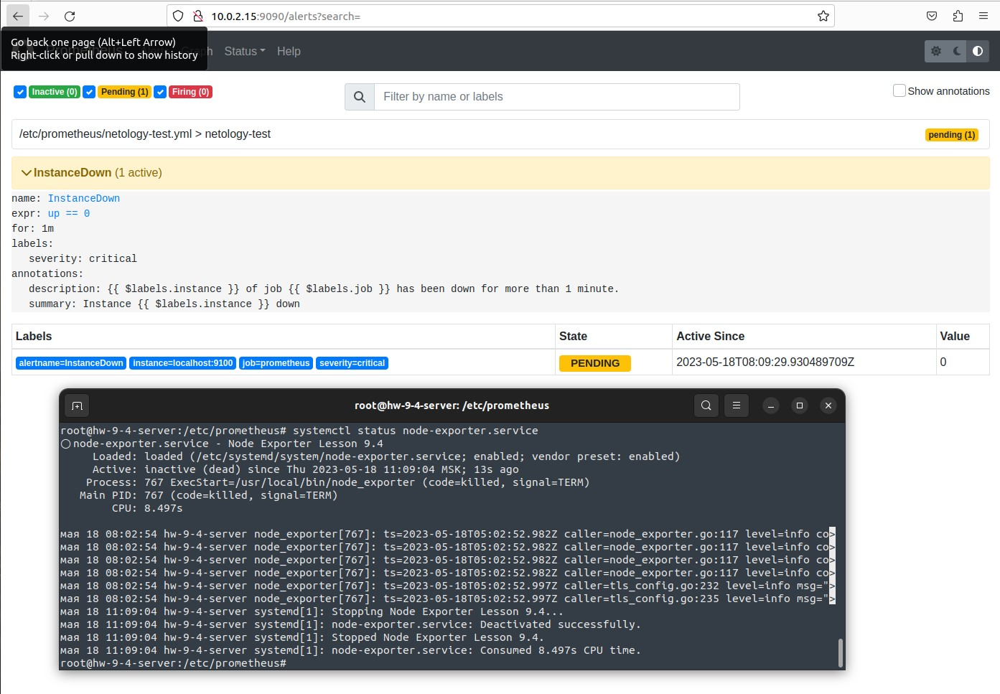
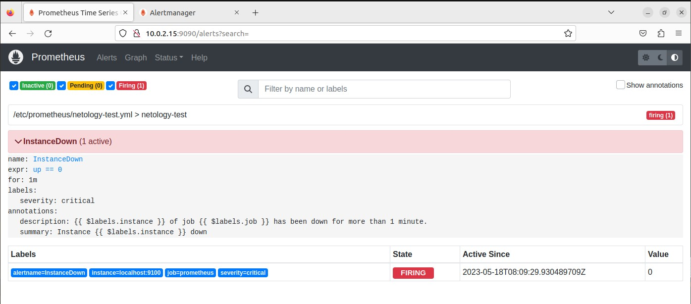
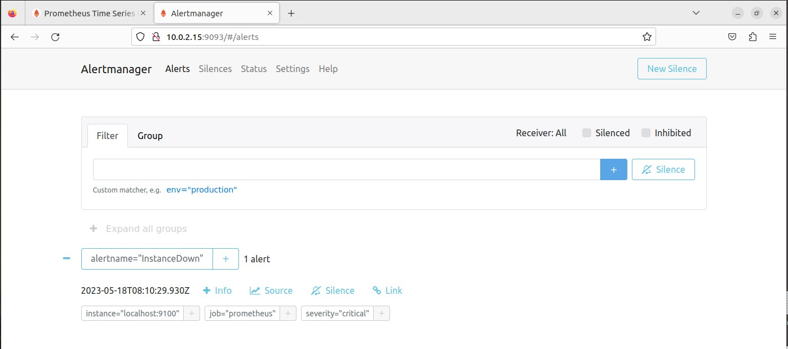
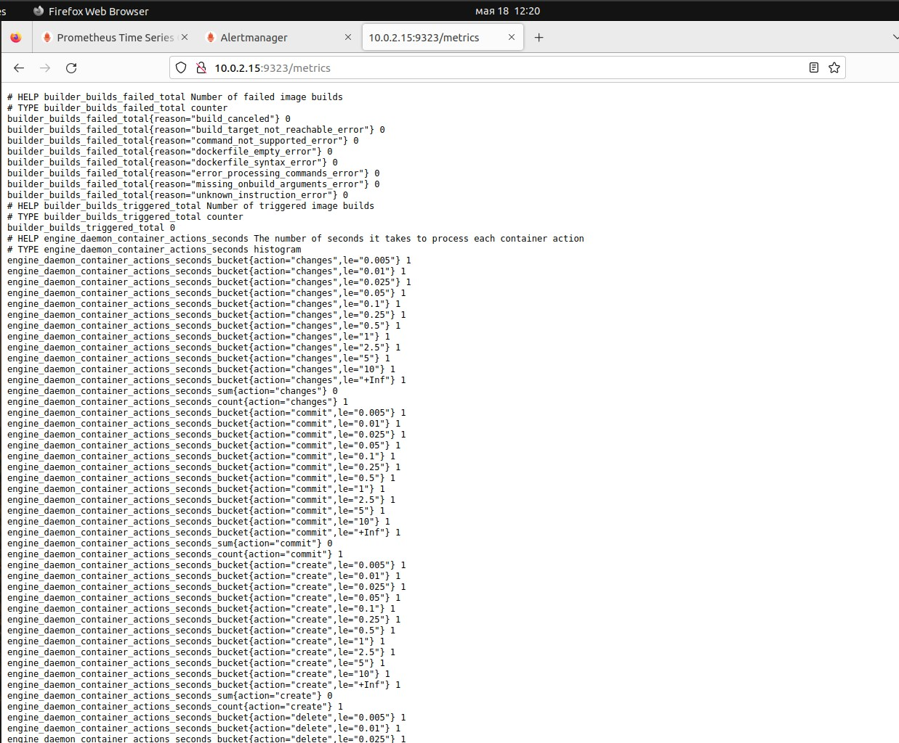

# Домашнее задание к занятию «Prometheus. Часть 2» - `Горбачев Олег`

### Цели задания
1. Научитья настраивать оповещения в Prometheus
2. Научиться устанавливать Alertmanager и интегрировать его с Prometheus
3. Научиться активировать экспортёр метрик в Docker и подключать его к Prometheus.
4. Научиться создавать дашборд Grafana

### Чеклист готовности к домашнему заданию
- [ ] Просмотрите в личном кабинете занятие "Система мониторинга Prometheus. Часть 2" 

### Инструкция по выполнению домашнего задания

1. Сделайте fork [репозитория c шаблоном решения](https://github.com/netology-code/sys-pattern-homework) к себе в Github и переименуйте его по названию или номеру занятия, например, https://github.com/имя-вашего-репозитория/gitlab-hw или https://github.com/имя-вашего-репозитория/8-03-hw).
2. Выполните клонирование этого репозитория к себе на ПК с помощью команды `git clone`.
3. Выполните домашнее задание и заполните у себя локально этот файл README.md:
   - впишите вверху название занятия и ваши фамилию и имя;
   - в каждом задании добавьте решение в требуемом виде: текст/код/скриншоты/ссылка;
   - для корректного добавления скриншотов воспользуйтесь инструкцией [«Как вставить скриншот в шаблон с решением»](https://github.com/netology-code/sys-pattern-homework/blob/main/screen-instruction.md);
   - при оформлении используйте возможности языка разметки md. Коротко об этом можно посмотреть в [инструкции по MarkDown](https://github.com/netology-code/sys-pattern-homework/blob/main/md-instruction.md).
4. После завершения работы над домашним заданием сделайте коммит (`git commit -m "comment"`) и отправьте его на Github (`git push origin`).
5. Для проверки домашнего задания преподавателем в личном кабинете прикрепите и отправьте ссылку на решение в виде md-файла в вашем Github.
6. Любые вопросы задавайте в чате учебной группы и/или в разделе «Вопросы по заданию» в личном кабинете.

---

### Задание 1
Создайте файл с правилом оповещения, как в лекции, и добавьте его в конфиг Prometheus.

### Требования к результату
- [ ] Погасите node exporter, стоящий на мониторинге, и прикрепите скриншот раздела оповещений Prometheus, где оповещение будет в статусе Pending

---

### Задание 2
Установите Alertmanager и интегрируйте его с Prometheus.

### Требования к результату
- [ ] Прикрепите скриншот Alerts из Prometheus, где правило оповещения будет в статусе Fireing, и скриншот из Alertmanager, где будет видно действующее правило оповещения

---

### Задание 3

Активируйте экспортёр метрик в Docker и подключите его к Prometheus.

### Требования к результату
- [ ] приложите скриншот браузера с открытым эндпоинтом, а также скриншот списка таргетов из интерфейса Prometheus.*

---
